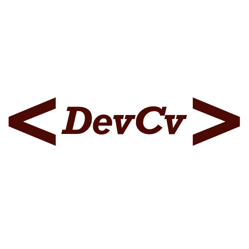

<div align="center">
  <br />
  
  <h1>DevCv</h1>
  <p>
     A simple CV builder for developers.
  </p>
</div>

<!-- Badges -->
<div align="center">
   <a href="https://github.com/cophilot/DevCv/blob/master/LICENSE">
       
   </a>
   <a href="https://github.com/cophilot/DevCv/stargazers">
       
   </a>
   <a href="https://github.com/cophilot/DevCv/commits/master">
       
   </a>
</div>

---

- [Privacy](#privacy)
- [Editing](#editing)
- [Add your own data](#add-your-own-data)
- [Languages](#languages)
  - [Multiple languages](#multiple-languages)
  - [Universal language](#universal-language)
- [Headings](#headings)
  - [General](#general)
  - [Contact](#contact)
  - [Skills](#skills)
  - [Jobs](#jobs)
  - [Education](#education)
  - [Other](#other)
- [Spacing](#spacing)
- [Settings](#settings)
- [Print](#print)
- [Local installation](#local-installation)

---

## Privacy

This project does not collect any personal data. The data you enter is only stored in your browser, after you accepted this, and is **not** sent to any server. If you want to be sure, you can check the source code of this project.

---

## Editing

You can edit the CV by clicking on the pencil icon in the top right corner.

---

## Add your own data

You can edit the data of the CV in the settings menu. On the right side, you see the [headings](#headings) of the CV. Click on a heading to edit the data for the specific heading and the CV will be updated. The data is stored in the local storage of your browser, when you accept this.

> To see how the data is structured, you can get more information in the [languages](#languages) and [headings](#headings) section.

---

## Languages

Each topic (heading) of the CV is structured as JSON object. The structure of the JSON object is the same for each topic. A topic can stored in multiple languages or in one universal language.

> You can change the language in the settings menu in the top right corner.

### Multiple languages

To provide a topic in multiple languages, you can add a JSON object with the language code as a key of the root JSON object. The value of the key is the data for the specific language.

Example:

```json
{
  "en": {
    "firstname": "John",
    "lastname": "Smith",
    "dob": "1. January 2000",
    "pob": "New York, USA",
    "languages": [
      "English - Native",
      "German - Fluent",
      "French - Basic"
    ]
  },
  "de": {
    "firstname": "John",
    "lastname": "Smith",
    "dob": "1. Januar 2000",
    "pob": "New York, Vereinigte Staaten",
    "languages": [
      "Englisch - Muttersprache",
      "Deutsch - Fließend",
      "Französisch - Grundkenntnisse"
    ]
  },
  ...
}
```

Currently the following languages are supported:

- English - `en`
- German - `de`
- Russian - `ru`
- Spanish - `es`
- French - `fr`

If an topic does not have a translation for the selected language english will be used as a fallback.

**The english language should always be provided!**

### Universal language

If you want to provide the same data for all languages, you can add the data with a key called `all` or `universal`.

Example:

```json
{
  "all": [
    {
      "text": "test@smith.example",
      "icon": "bi bi-envelope",
      "link": "mailto:john@smith.example"
    },
    {
      "text": "+1 234 56789",
      "icon": "bi bi-telephone",
      "link": ""
    },
    ...
}
```

---

## Headings

Each heading of the CV is structured as JSON object. The structure for each heading is described below.

### General

_The general section is used for the personal information of the CV._

- `firstname` - The first name of the person.
- `lastname` - The last name of the person.
- `dob` - The date of birth of the person.
- `pob` - The place of birth of the person.
- `languages` - An array of languages the person speaks.

Example:

```json
{
  "en": {
    "firstname": "John",
    "lastname": "Smith",
    "dob": "1. January 2000",
    "pob": "New York, USA",
    "languages": [
      "English - Native",
      "German - Fluent",
      "French - Basic"
    ]
  },
  ...
}
```

> Note: The `languages` array will be displayed on the left side of the CV.

### Contact

_The contact section is used for the contact information of the CV, that will be displayed on the left side of the CV._

The contact section is structured as an array of JSON objects. Each JSON object represents a contact entry.

- `text` - The text of the contact entry.
- `icon` - The icon of the contact entry using [Bootstrap Icon](https://icons.getbootstrap.com/).
- `link` - The link of the contact entry.

Example:

```json
{
  "all": [
    {
      "text": "test@smith.example",
      "icon": "bi bi-envelope",
      "link": "mailto:john@smith.example"
    },
    {
      "text": "+1 234 56789",
      "icon": "bi bi-telephone",
      "link": ""
    },
    ...
}
```

### Skills

_The skills section is used for the skills information of the CV, that will be displayed on the left side of the CV._

The skills section is structured as an array of JSON objects. Each JSON object represents a skill entry.

- `name` - The name of the skill.
- `link` - The link to get more information about the skill.
- `url` - The URL of the logo to display.
- `level` - The level of the skill (_1-10_)

You can also leave the `url` empty to use a predefined logo that can be found [here](src/assets/icons/logos). The predefined logos are named after the skill name and will be used if the name of the skill matches the name of the predefined logo (case insensitive and the ending `.png` is not required).

Example:

```json
{
  "all": [
    {
      "name": "Angular",
      "link": "https://angular.io/",
      "url": "",
      "level": 8
    },
    {
      "name": "Next.js",
      "link": "https://nextjs.org/",
      "url": "https://creazilla-store.fra1.digitaloceanspaces.com/icons/3219990/nextjs-icon-md.png",
      "level": 3
    },
    ...
}
```

### Jobs

_The jobs section is used for the job experience information of the CV. And will be displayed on the right side of the CV._

The jobs section is structured as an array of JSON objects. Each JSON object represents a job entry.

- `job` - The job title.
- `company` - The company name.
- `url` - The URL of the company.
- `location` - The location of the company.
- `date` - The date of the job.
- `description` - An array of strings that describes the job in bullet points.

Example:

```json
{
  "en": [
    {
      "job": "Full Stack Developer",
      "company": "Smith Corp",
      "url": "https://www.smith-corp.com/",
      "location": "San Francisco",
      "date": "January 2023 - present",
      "description": [
        "Doing stuff",
        "Doing more stuff",
        "Doing even more stuff"
      ]
    },
    ...
}
```

### Education

_The education section is used for the education information of the CV. And will be displayed on the right side of the CV._

The education section is structured as an array of JSON objects. Each JSON object represents an education entry.

- `name` - The name of the education.
- `school` - The name of the institution.
- `location` - The location of the institution.
- `year` - The year of the education.
- `description` - A string that gives more information about the education i.e. the grade.

Example:

```json
{
  "en": [
    {
      "name": "Computer Science B.Sc.",
      "school": "MIT",
      "location": "Cambridge, MA",
      "year": "ongoing",
      "description": "Current grade: B"
    },
    ...
}
```

### Other

_The other section is used for the custom topics of the CV. And will be displayed on the right side of the CV._

The other section is structured as an array of JSON objects. Each JSON object represents a custom topic entry.

- `id` - The id of the custom topic.
- `title` - The title of the custom topic (will be used as the heading).
- `description` - A string that describes the custom topic.
- `list` - An array of strings that describes the custom topic in bullet points.

Example:

```json
{
  "en": [
    {
      "id": "certification",
      "title": "Certifications",
      "description": "",
      "list": [
        "Azure Fundamentals",
        "AWS Cloud Practitioner"
      ]
    },
```

---

## Spacing

To give the CV a better look, you can add some spacing betwen the topics to align the content better. You can edit the spacing in the settings menu.

The spacing is a JSON object and descripes how many pixels the spacing should be after the specific topic to the next topic.

The keys of the JSON object are the topic ids (for the custom topics) or the names of the topics (for the predefined topics).

Example: To add a 70px gap after the Skills section so that the languages section is on the next page and a 130px gap after the custom certification section, you can add the following JSON object to the spacing settings:

```json
{
  "contact": 0,
  "skills": 70,
  "languages": 0,
  "work": 0,
  "education": 0,
  "certification": 130
}
```

---

## Settings

You can apply some general settings to the CV in the settings section. The settings are structured as a JSON object:

- `protected` - If enabled a protection layer will be added on top of the CV to prevent copying the content.
- `export` - If users are allowed to export the CV in different formats.
- `bars` - If the accent bars should be displayed.

```json
{
  "protected": false,
  "export": true,
  "bars": true
}
```

---

## Print

> Export via **Google Chrome** or **Microsoft Edge** for the best quality!

1. Click on the print button in the settings menu
2. Select the desired printer to _"Save as PDF"_
3. Choose the pages you want to export (e.g. 1-2)
4. Click on _"More settings"_
5. Set the paper size to _"A4"_
6. Set the margins to _"Default"_
7. Set the scale to _"140%"_ or play around with the scale to get the best result
8. Uncheck _"Headers and footers"_
9. Check _"Background graphics"_
10. Click on _"Print"_

---

## Local installation

1. Clone the repository
2. Run `npm start` to start the development server and install the dependencies
3. Navigate to [http://localhost:4200/](http://localhost:4200/)

---

_This project was generated with [Angular CLI](https://github.com/angular/angular-cli) version 16.2.2._

---

By [Philipp B.](https://github.com/cophilot)
